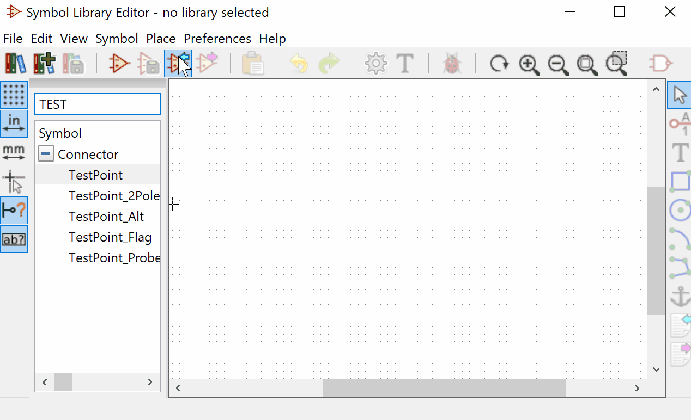

KiSymGen

KiSymGen is a cross platform utility enabling users to generate kicad schematic symbols using a graphical tool.
KiSymGen is developed based on imgui and GLFW3.

Build On windows. 

Tested with visual studio 2017.

*	Navigate to the kisymgen folder.
*	Double click on the kisymgen.sln file which should open the project in visual studio.
*	Build the project and run.

Build on Linux.

Install GLFW 

*	git clone https://github.com/glfw/glfw.git
*	cd glfw
*	cmake -G "Unix Makefiles"
*	make
*	sudo make install

Download this repo Navigate to kisyngen/kisymgen_src folder

*	run make

Prebuilt binaries are present for linux and windows in the prebuilt folder in branch prebuilt 

Usage 

Import the generated symbol to kicad 

TODO
*	Add Support for millimeter metric unit
*	Add Intutive numbering. Currently auto numbering top -> bottom with left right decal and counter clockwise for pins on all four side.
*	Add support for pin naming using a table view.
*	Add Multi unit part support.
*	Add support for demorgans and triangle parts.
*	Ongoing bug fixes if any.
*	refactor code to improve readability.

